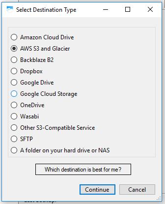
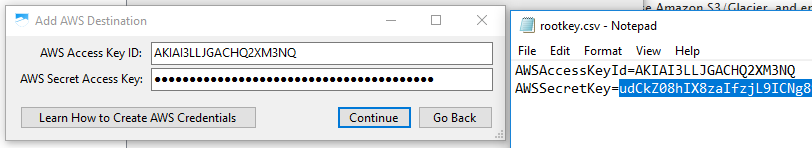
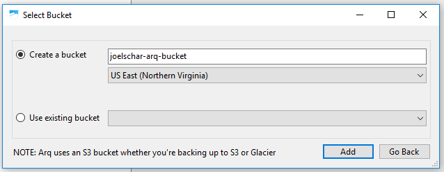
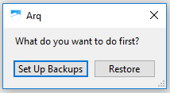
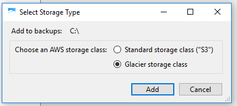
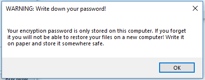
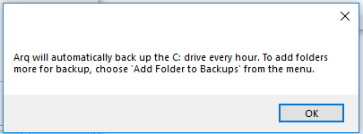
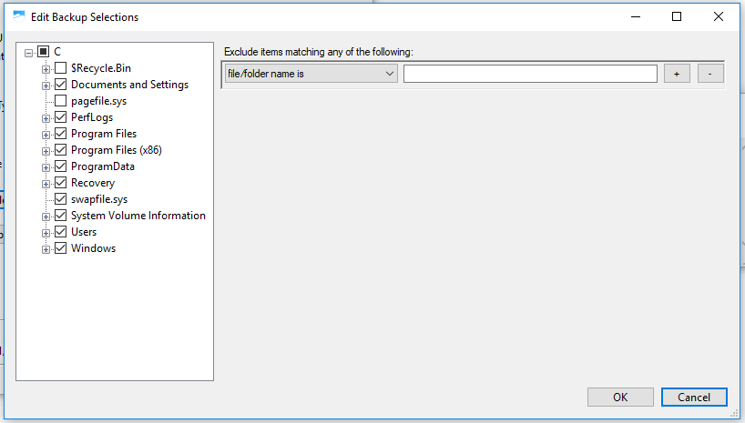
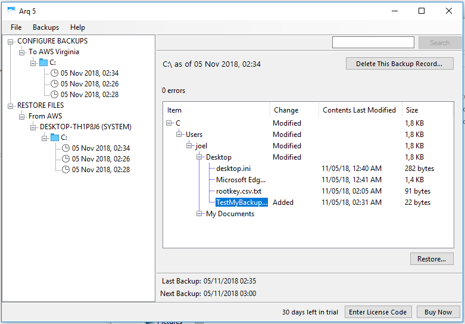

# Arq

## Installation

- Après l'installation de Arq, choisir de faire la sauvegarde sur AWS S3 et Glacier.

- Récupérer les clés de connexions depuis le compte amazone :
  L'administrateur aura créé l'utilisateur IAM depuis la plateforme Amazone.

- Choisir un nom de bucket et configurer le lieu de sauvegarde des données :

  

- Créer une nouvelle sauvegarde

  

- Choisir le type de service a utiliser.
  

- Choisir un mot de passe
  

- écrire le mot de passe sur un bout de papier

  

- Arq fera la sauvegarde une fois par heure
  

- Par défaut Arq sauvegarde tout le disque C:\ de l'ordinateur. Il est possible de customiser les données qui vont être sauvée afin de ne garder que les informations importantes.

  

- il est ensuite possible de restaurer les données en choisissant exactement.

  

