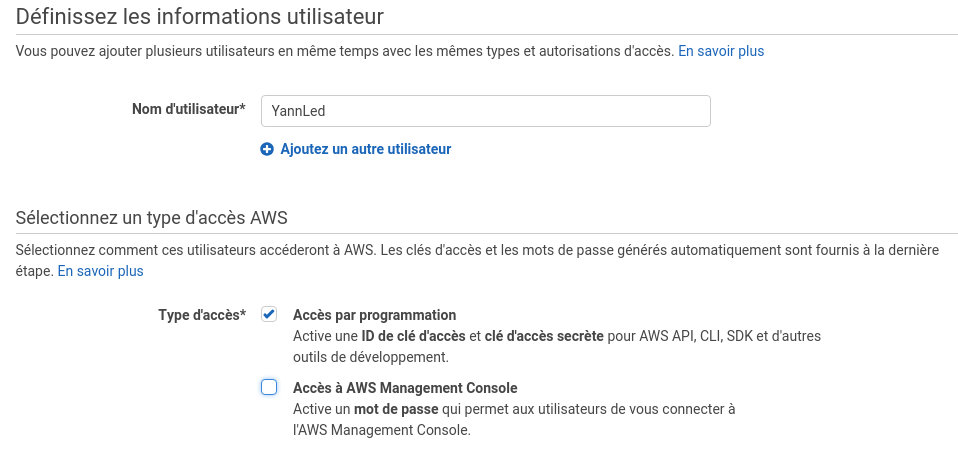
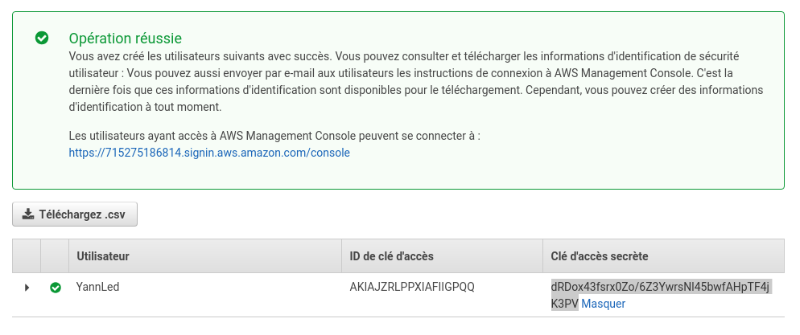
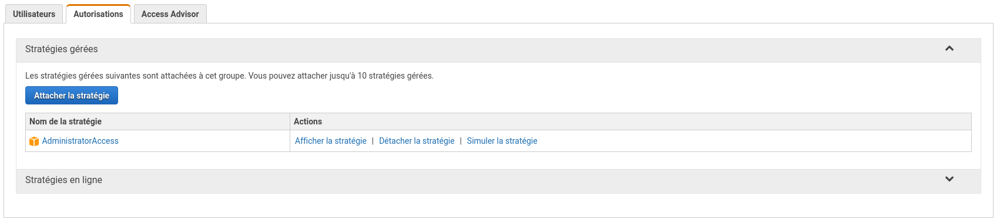
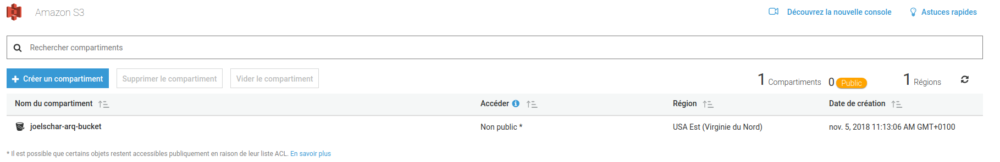
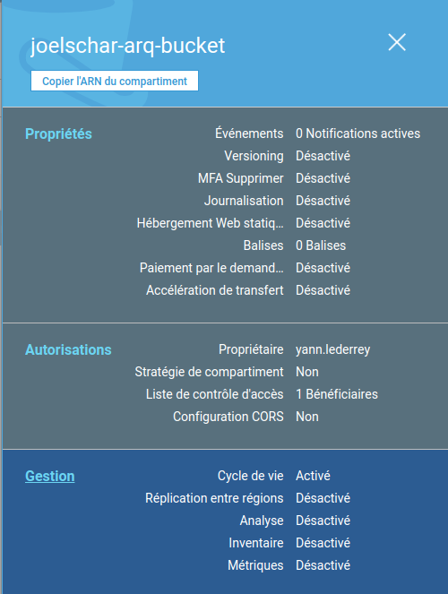

# Documentation S3/Glacier

**S3** est un service d'Amazon de cloud permettant de configurer des "buckets" où l'utilîsateurs va sauvegarder ses données. Ces buckets peuvent être définis selon plusieurs régions ayant un incident sur leur rapidité d'accès et leur tarif.

**Glacier** est un service d'Amazon de cloud "permanent" ayant pour but de stocker des données pour de longues durées et rarement récupérées (par exemple 2ème / 3ème backup).

**Dans notre cas** nous utiliserons S3 pour stocker les données puis après un certain temps les données seront automatiquement mise en Classe de stockage : Glacier.

# Amazon Préparation

- Go to console.aws.amazon.com and create an account

- Aller sur https://console.aws.amazon.com/iam afin de gérer les compte utilisateurs

- Effectuer la liste de recommendation de statut de sécurité

  - Activer MFA : 
  - Créer des utilisateurs IAM :
    - Ajouter un utilisateur
    - 
    - Suivant
    - Créez un groupe, (par exemple : un groupe par département)
    - Nommez le groupe, vous pouvez aussi définir des stratégie de groupe, nous passons cela pour le moment.
    - Cliquez sur vérification
    - 
    - Téléchargez le csv et envoyer le à l'utilisateur concerné.

## Gestion utilisateur

- Allez sur : https://console.aws.amazon.com/iam/home#/home
- Dans l'onglet User
  - Vous pouvez voir la liste d'utilisateur
  - et la liste d'information sur ces utilisateurs tel que leur dernière activité etc..
  - Cliquez sur un user :
    - Vous avez accès au autorisation de cet utilisateur, nous conseillons de gérer cela via les groupes.
    - 
    - Vous avez accès au groupes de l'utilisateur.
    - Vous avez accès au informations d'identification de sécurité.
    - Vous avez accès a un visualisateur d'acces de sécurité.
- Dans l'onglet Groupes

  - Vous pouvez gérer vos groupes
  - Cliquez sur un de vos groupe:
    - Vous avez accès aux utilisateurs de votre groupe.
    - Vous avez accès aux autorisation du groupe, c'est ici que nous allons gérer les droits des utilisateurs du groupe.
    - 
    - Vous avez accès à un visualisation d'accès pour vérifier votre configuration d'accès
- Dans l'onglet Rôle
  - Vous pouvez configurer des rôles spécifique afin de mieux gérer l'accès à la partie administration de amazone S3/Glacier. Ceci n'est pas obligatoire si vous êtes le seul à gérer les backup de l'entreprise.
- Dans l'onglet Stratégie:
  - Vous pouvez créer vos propre stratégie d'accès personnalisé
- Dans l'onglet Fournisseur d'identité:
  - Vous pouvez ajouter des fournisseurs d'identitité, ceci ne sera pas traité dans ce tutoriel.
- Dans l'onglet Paramètre de compte :
  - Vous pouvez gérer les stratégie de mot de passe, Ceci n'est pas utile dans notre cas car les utilisteurs utilisent des clés pour l'utilisation et non pas un user/mot de passe
- Dans l'onglet Rapport sur les informations d'identification : Permet de récupérer un rapport sur utilisateurs.

## Gestion des bucket S3

- Aller sur https://s3.console.aws.amazon.com/s3/home?region=us-east-1
  - Vous pouvez voir les buckets créées par vos utilisateurs.
  - 
  - En cliquant dessus vous pouvez effectuer des actions sur le bucket et voir son état :
  - Vous pouvez alors ajuster les configurations et la sécurité de de vos buckets.
  - 

